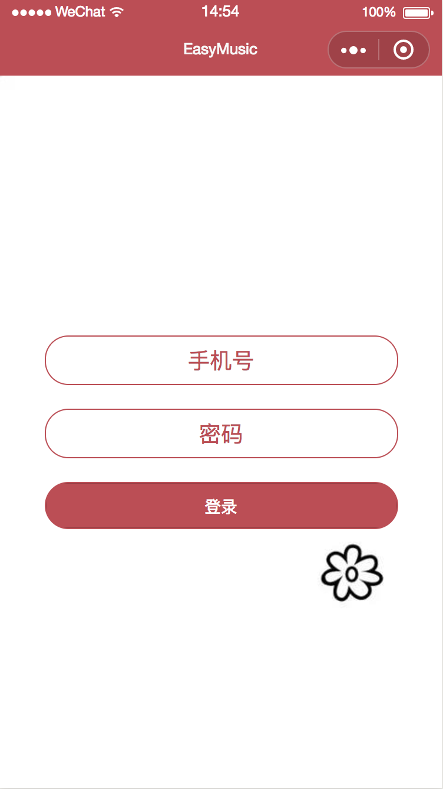
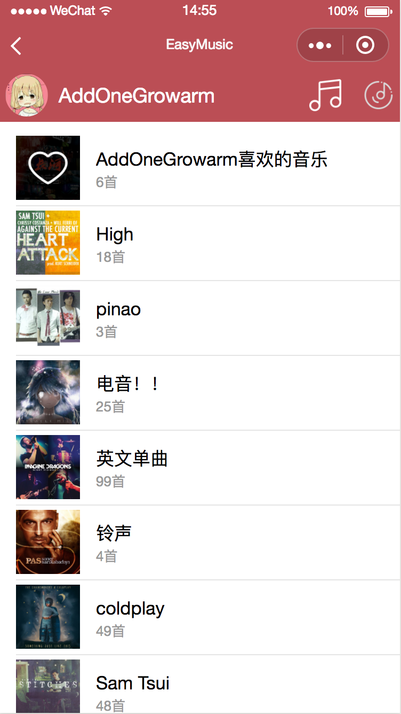
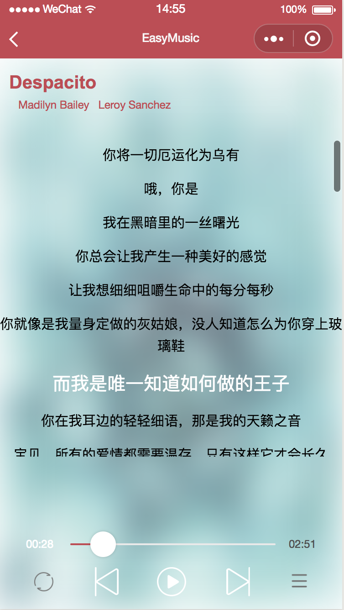
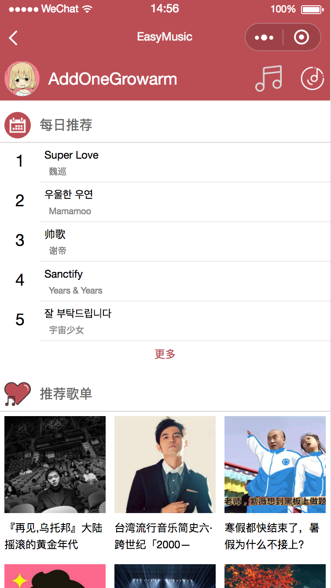

#wyMusic
-----
#### 介绍

使用微信小程序模仿网易云音乐,接口来源于: http://musicapi.leanapp.cn/

语法比较基础 适合初学者学习~ 大佬轻喷

#### 功能
+ 网易云账号登录
+ 歌单查看
+ 每日推荐
+ 歌曲随机,单曲,列表循环
+ 歌词滚动
+ ....







```
直接微信开发者工具打开用啦
```

> 麻烦动动手指给我个小星星鼓励一下啦QAQ